# 🎨 Cartoon-Image-Converter

## 1. Project Overview

Cartoon-Image-Converter is an OpenCV-based image processing project that transforms a normal image into a cartoon-style image.

This implementation focuses on:

* Color simplification via K-means clustering
* Stable edge extraction using internal gradient
* Suppression of weak/noisy edges using baseline filtering
* Direct conversion of gradients into line masks (without contour reconstruction)

The goal is to generate **clean outlines and flat color regions**, similar to hand-drawn cartoon images.

---

## 2. Project Summary

The pipeline follows this exact order:

1. Image resizing
2. Bilateral filtering (edge-preserving smoothing)
3. Color quantization (K-means)
4. Grayscale conversion + blur
5. Internal gradient computation
6. Weak edge suppression (baseline subtraction)
7. Contrast enhancement
8. Line mask generation (invert + threshold-like cleanup)
9. Morphological refinement (close + dilate)
10. Final compositing

---

## 3. Processing Pipeline (Code-Aligned)

**Target Image**

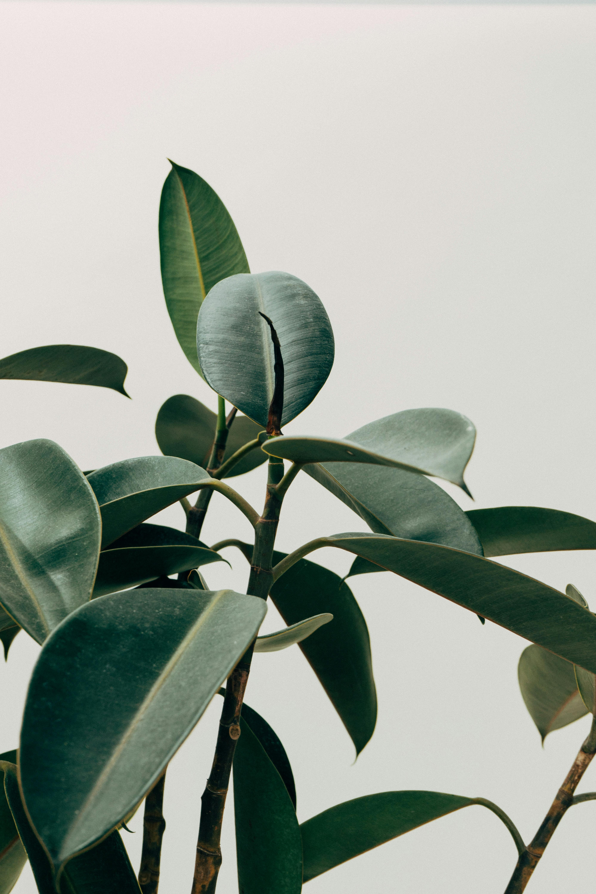
<sub>
Image source: Photo by [Scott Webb] on 
<a href="https://www.pexels.com/ko-kr/photo/1048035/">Pexels</a>
</sub>

---

### Step 0. Image Resize

```python
if h > max_height:
    img = cv2.resize(...)
```

**Purpose**

* Reduce computation cost
* Normalize input size

---

### Step 1. Bilateral Filtering (Edge-Preserving Smoothing)

```python
color = cv2.bilateralFilter(img, 9, 200, 200)
```

**Purpose**

* Smooth color while preserving edges
* Remove minor texture noise

---

### Step 2. Color Quantization (K-means)

```python
color = center[label.flatten()].reshape(color.shape)
```

**Purpose**

* Reduce color complexity
* Create flat cartoon-like regions

---

### Step 3. Grayscale Conversion + Blur

```python
edge_src = cv2.cvtColor(color, cv2.COLOR_BGR2GRAY)
edge_src = cv2.GaussianBlur(edge_src, (3, 3), 0)
```

**Purpose**

* Prepare stable input for edge detection
* Remove small noise

**Output**

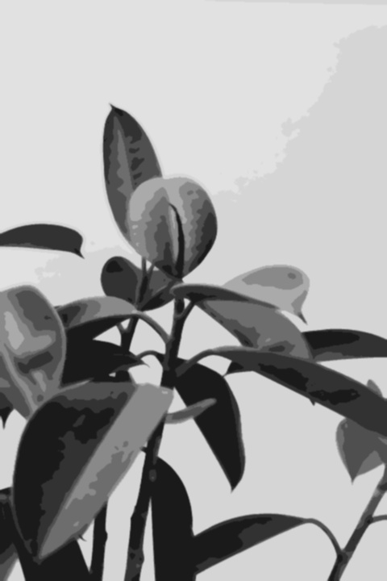

---

### Step 4. Internal Gradient Extraction

```python
eroded = cv2.erode(edge_src, kernel)
grad = cv2.subtract(edge_src, eroded)
```

**Purpose**

* Extract edge intensity
* Reduce double-edge artifacts compared to standard gradient

**Output**

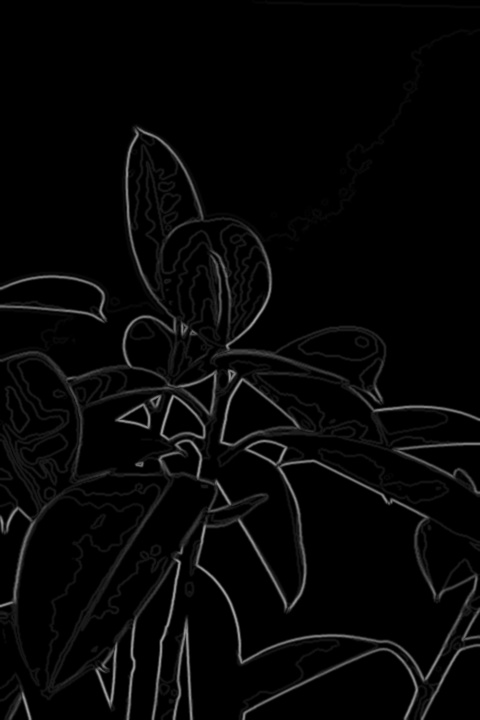

---

### Step 5. Weak Edge Removal (Baseline Subtraction)

```python
grad_cut = cv2.subtract(grad, baseline_img)
```

**Purpose**

* Remove weak edges below threshold
* Keep only strong structural boundaries

**Output**

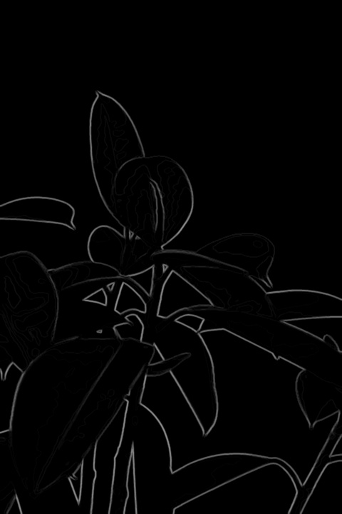

---

### Step 6. Gradient Contrast Enhancement

```python
grad_norm = cv2.normalize(grad_cut, None, 0, 255, cv2.NORM_MINMAX)
grad_emph = cv2.convertScaleAbs(grad_norm, alpha=2.5)
grad_emph = cv2.GaussianBlur(grad_emph, (3, 3), 0)
```

**Purpose**

* Amplify strong edges
* Increase contrast between edges and background

**Output**

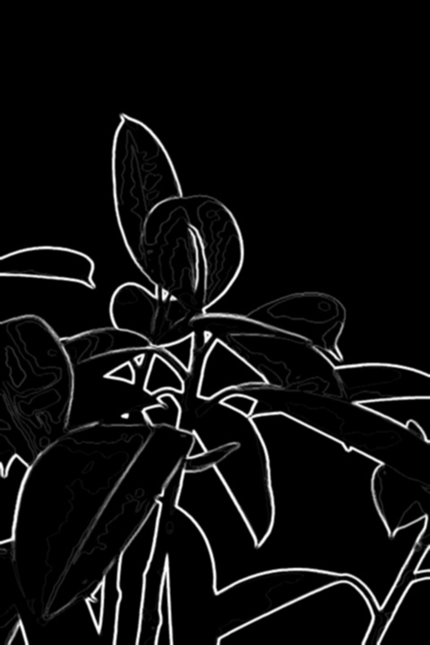

---

### Step 7. Line Image Generation

```python
line_img = 255 - grad_emph
line_img = np.where(line_img > 220, 255, line_img)
```

**Purpose**

* Convert gradient into black line mask
* Remove faint gray edges

---

### Step 8. Morphological Refinement

```python
line_mask = 255 - line_img
line_mask = cv2.morphologyEx(line_mask, cv2.MORPH_CLOSE, kernel)
line_mask = cv2.dilate(line_mask, kernel)
line_img = 255 - line_mask
```

**Purpose**

* Connect broken edges
* Slightly thicken lines
* Improve continuity

**Output**

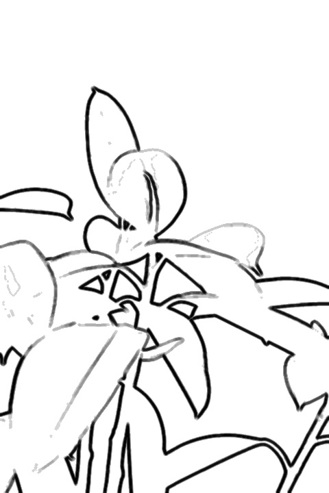

---

### Step 9. Final Composition

```python
cartoon = color * line_mask
```

**Purpose**

* Overlay edges onto simplified color image
* Produce final cartoon rendering

**Output**

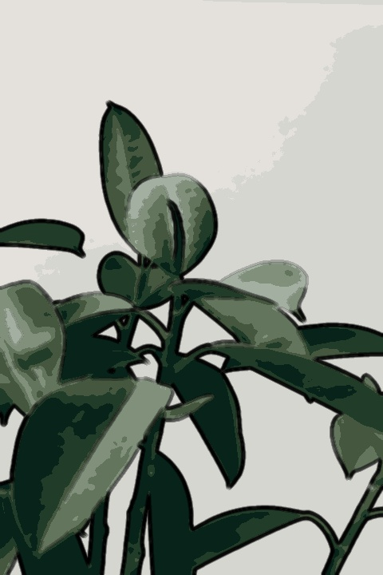

---

## 4. Limitations

### ❌ 1. Low Contrast Images

* Weak gradients are removed during baseline subtraction
* Important edges may disappear

**Example**

<p align="center">
  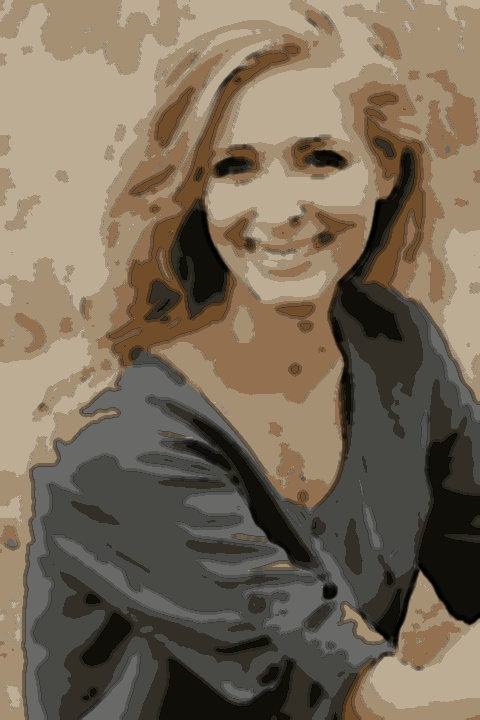
  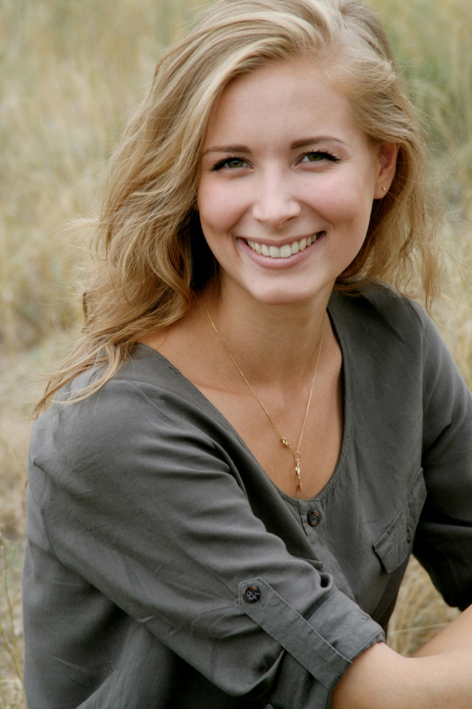
</p>
<sub>
Image source: Photo by [Pixabay] on 
<a href="https://www.pexels.com/photo/woman-in-black-scoop-neck-shirt-smiling-38554/">Pexels</a>
</sub>

---

### ❌ 2. High Texture / Noise Images

* Small textures can survive filtering
* Results in cluttered edges

**Example**

<p align="center">
  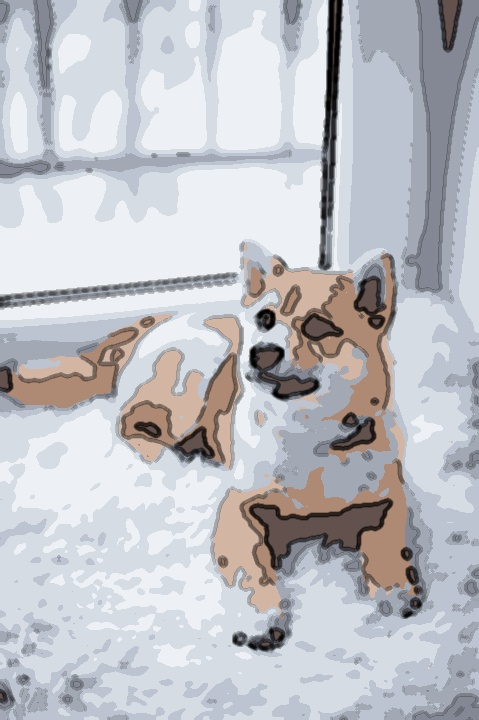
  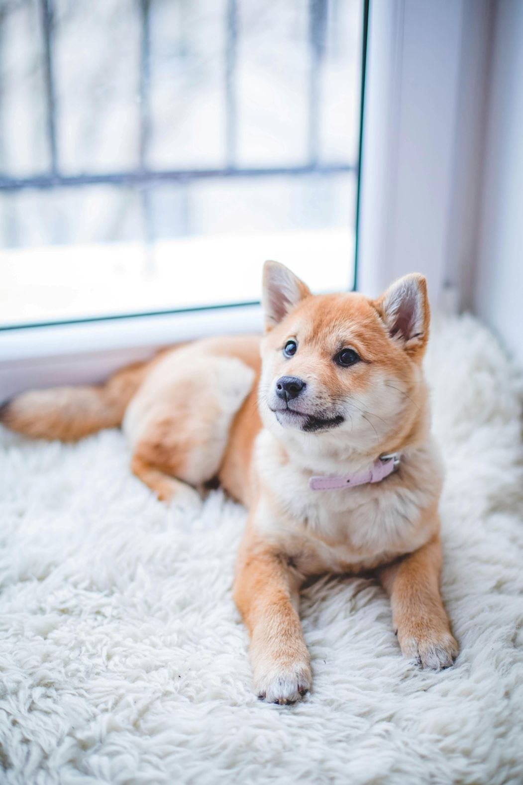
</p>
<sub>
Image source: Photo by [Valeria Boltneva] on 
<a href="https://www.pexels.com/ko-kr/photo/1805164/">Pexels</a>
</sub>

---

### ❌ 3. Parameter Sensitivity

Important parameters:

* `baseline` → edge suppression strength
* `alpha` → contrast level
* `kernel size` → edge thickness
* `K` → color simplification level

Small changes can significantly affect output quality.

---

## 5. Discussion

This approach improves cartoon rendering quality by:

* Avoiding contour reconstruction (reduces distortion)
* Using internal gradient to reduce double edges
* Removing weak edges before enhancement

However, the method is still heuristic-based and sensitive to input image characteristics.

---

## 6. How to Run

```bash
python main.py
```

### Requirements

* Python 3.x
* OpenCV
* NumPy

---

## 7. Output Summary

| Stage             | Image                          |
| ----------------- | ------------------------------ |
| Edge Source       | assets/edge_source.jpg         |
| Gradient          | assets/internal_gradient.jpg   |
| Gradient Cut      | assets/gradient_cut.jpg        |
| Enhanced Gradient | assets/gradient_emphasized.jpg |
| Line Image        | assets/line_image.jpg          |
| Final Output      | assets/cartoon.jpg             |

---
